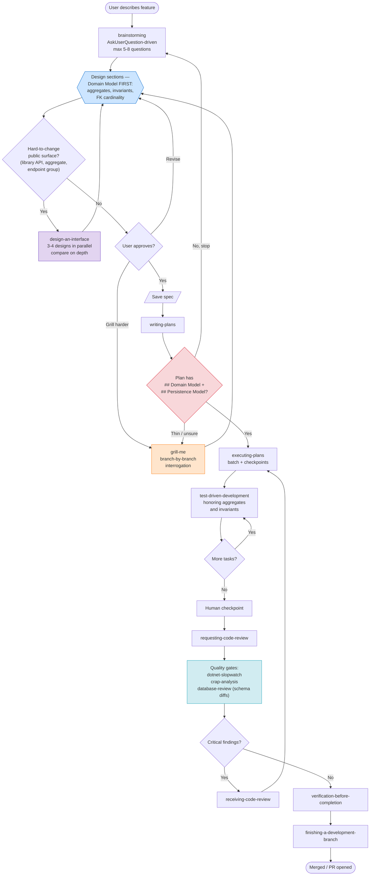
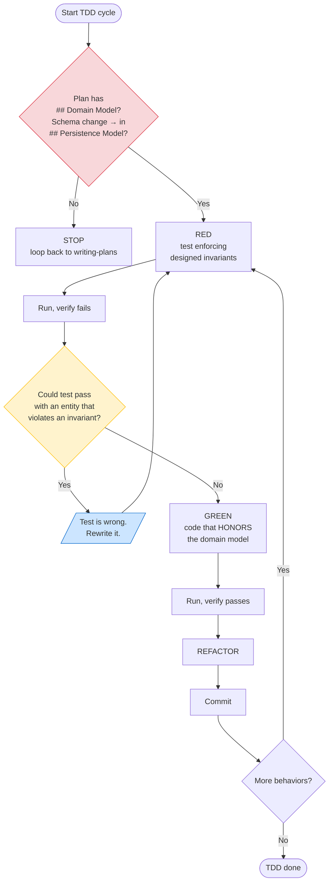

# DotLightSkillset

**A lightweight, curated Claude Code skillset for .NET developers.**

Plugin identifier: `dotlight-skillset`

Combines five upstream MIT skill libraries into one opinionated bundle, with workflow overrides that fix the rough edges of "pure TDD" agent loops — and, since 0.6.0, a minimalism layer that keeps generated code reviewable by humans and a designed (not test-accreted) persistence layer.

## What it bundles

- **Workflow (19 skills)** — customized fork of [obra/superpowers](https://github.com/obra/superpowers) **v6.1.1** plus adapted skills from [mattpocock/skills](https://github.com/mattpocock/skills) (`grill-me`, `design-an-interface`, `grill-with-docs`), [hsmejky/skills](https://github.com/hsmejky/skills) (`improve-architecture`, `caveman`), and [DietrichGebert/ponytail](https://github.com/DietrichGebert/ponytail) (`lazy-senior-dev`): brainstorming → writing-plans → executing-plans → TDD → code review → finishing-branch, plus worktrees, systematic-debugging, parallel agents, skill authoring, doc-aware grilling, Ousterhout-style architecture review, explicit-trigger ultra-terse mode, and the **lazy-senior-dev** minimalism reflex (reuse before write, stdlib before dependency, the minimal version of the agreed design).
- **.NET patterns (28 skills)** — curated fork of [Aaronontheweb/dotnet-skills](https://github.com/Aaronontheweb/dotnet-skills) **v1.4.1**: C# standards, Minimal API design, DI, configuration, serialization, Aspire (4 skills — configuration, service-defaults, integration-testing, **mcp-first** for runtime debugging), OpenTelemetry (v1.4.1 rewrite + 3 reference files), Testcontainers, Playwright (Blazor + CI caching), ILSpy decompilation, quality gates (slopwatch + CRAP + **database-review**). Plus dotlight originals: **`rider-mcp-first`** (Rider MCP semantic ops over filesystem Grep/Read — **50–90 % token savings on .NET exploration**), **`database-design-conventions`** (lifecycle-pattern catalog incl. ActiveFrom/ActiveTo temporal versioning, one-schema-one-dialect, normalization gate), and **`database-review`** (schema quality gate against test-shaped schemas and dialect drift).
- **Specialized .NET agents (3)** — `dotnet-performance-analyst`, `dotnet-benchmark-designer`, `dotnet-concurrency-specialist`. Use the `Agent` tool with `subagent_type` matching the agent name.

Superpowers drives the **process**, dotnet-skills supply the **patterns**, agents do **focused diagnostic work**.

## Why this exists

Out-of-the-box agent workflows have four habits that hurt .NET projects:

1. **TDD-first domain discovery.** "Minimal code to pass" applied literally produces entities without relationships and invariants.
2. **Text-based Socratic dialogue.** Multiple-choice questions as plain-text lists, even in clients that render `AskUserQuestion` as clickable choice cards.
3. **Over-generation.** Agents produce enormous, speculative diffs that no senior developer can sustainably review — humans are lazy in the good way; agents are not.
4. **Test-shaped schemas.** A DB layer accreted from TDD cycles is tailor-made for the tests, not designed for persistence.

Fixed in modified `SKILL.md` files:

- **`brainstorming`** — prefers `AskUserQuestion` over text multi-choice, caps questions at 5-8, enforces Domain Model as the first design section, and always proposes **the minimal version first** (reviewability is a design constraint).
- **`writing-plans`** — requires a `## Domain Model` section AND a `## Persistence Model` section (may be `None — no schema changes`) derived from the design. If missing, loops back. **Minimalism Gate**: mandatory `## Non-Goals`, every file names its forcing requirement, reverse task-to-requirement coverage. Default exec sub-skill is `executing-plans`, not `subagent-driven-development`.
- **`test-driven-development`** — domain model must exist before first RED-GREEN-REFACTOR; schema changes are gated on the plan's Persistence Model; tests go at pre-agreed seams. Calls out "test-cheating" (satisfying tests by violating invariants) and tautological tests as the top LLM-TDD failure modes.
- **`lazy-senior-dev`** + **`requesting-code-review`** — the ladder (does it need to exist → reuse → stdlib → platform → one line → minimum code) governs implementation of the agreed design; review flags diffs over a human review budget, single-implementation interfaces, and unrequested features as spec-compliance findings.

## What's deliberately excluded

- From Superpowers: `subagent-driven-development` (the v6.0.0 rewrite is much improved — ~2x faster, per-task over-engineering verdicts — but `executing-plans` remains the dotlight exec mode; its best ingredients are ported into `requesting-code-review` and `dispatching-parallel-agents` instead). Also the brainstorming **visual companion** (browser server): token-heavy, Windows-fragile, and orthogonal to the .NET workflow — deleted in 0.6.0.
- From dotnet-skills (skills): all `akka-*` (5), `aspire-mailpit-integration`, `mjml-email-templates`, `verify-email-snapshots`, `marketplace-publishing`, `skills-index-snippets`, `r3-reactive-extensions` (new in upstream v1.4.0)
- From dotnet-skills (agents): `akka-net-specialist`, `docfx-specialist`, `roslyn-incremental-generator-specialist`

For Akka.NET, Mailpit, or DocFX work, install the upstream `dotnet-skills` plugin alongside — they cooperate fine.

## Companion plugins (recommended pairings)

DotLightSkillset focuses on the .NET workflow surface. For adjacent specialties, pair it with:

- **[timescale/pg-aiguide](https://github.com/timescale/pg-aiguide)** (`claude plugin marketplace add timescale/pg-aiguide`) — vendor-maintained Postgres + TimescaleDB skills (schema design, lock-safe migrations, hypertable mechanics) plus a docs-search MCP server. Dotlight's `database-design-conventions` is the **house-conventions layer on top**: it owns the temporal-versioning dialect, ORM mappings, and the one-schema-one-dialect rule, and defers generic Postgres/Timescale mechanics to pg-aiguide. Where styles differ (index naming, range-vs-two-column versioning), dotlight's conventions win.
- **[VoltAgent — `voltagent-data-ai`](https://github.com/VoltAgent/awesome-claude-code-subagents)** — specialist agents for data-heavy .NET work: `postgres-pro`, `database-optimizer`, `data-engineer`, `ml-engineer`, `data-scientist`. Particularly useful with TimescaleDB / EF Core / NHibernate projects that grow ML-adjacent.
- **`playwright@claude-plugins-official`** — general Playwright MCP integration for non-Blazor SPA stacks (Vue/Vite, React, etc.). Dotlight only ships the Blazor-specific Playwright skill.

These work in parallel — no conflicts.

## Who this is for

.NET developers using **.NET 10**, **Aspire** (or pure host builders), **Minimal API**, **NHibernate or EF Core**, **Postgres / TimescaleDB**, and **Vue/Vite** or **Blazor** frontends, who want the auto-review / brainstorming / planning flow from Superpowers without having the agent design the domain for them via TDD. If you also need Akka.NET, install the upstream `dotnet-skills` plugin alongside — DotLightSkillset is opinionated about which extensions live in scope.

## Installation

### Public marketplace (recommended)

```
/plugin marketplace add MudraMartin/dotlight-skillset
/plugin install dotlight-skillset@dotlight-marketplace
```

Update:

```
/plugin marketplace update
```

### Local clone

```bash
git clone https://github.com/MudraMartin/dotlight-skillset.git ~/dotlight-skillset
```

Then in Claude Code:

```
/plugin marketplace add ~/dotlight-skillset
/plugin install dotlight-skillset@dotlight-marketplace
```

### `.plugin` file (offline)

```bash
cd dotlight-skillset
zip -r dotlight-skillset.plugin . -x "*.DS_Store" -x ".git/*"
```

Then drag-drop or use your client's plugin install flow.

## What's in the plugin

### Workflow (19 skills)

| Skill | Role |
|---|---|
| `brainstorming` | Socratic design refinement — **uses `AskUserQuestion`**, enforces domain-first design, always proposes the minimal version first |
| `lazy-senior-dev`§ 🆕 | Minimalism reflex for any implementation work — the ladder (need → reuse → stdlib → platform → one line → minimum code), root-cause bug fixes, `// lazy:` debt comments, safety carve-outs. Governs implementation of the agreed design, never the design itself. |
| `grill-me`† | Stress-test an existing plan/spec — branch-by-branch interrogation with recommended answers, enact stop-gate (decisions are the user's). |
| `grill-with-docs`† | Doc-aware grilling — same Socratic discipline, plus glossary cross-check, code cross-reference, inline updates to glossary / ADRs. Path discovery for any project layout. |
| `improve-architecture`‡ | Ousterhout-style audit — find shallow modules, propose deepening opportunities with Strong / Worth exploring / Speculative badges and a Top recommendation. One adapter = hypothetical seam; two = real. |
| `design-an-interface`† | Generate 3–4 radically different designs in parallel, then compare on depth and ease of correct use. (Lighter standalone variant of `improve-architecture/INTERFACE-DESIGN.md`.) |
| `writing-plans` | Bite-sized plan — **requires `## Domain Model` + `## Persistence Model`** or loops back; Minimalism Gate (Non-Goals, forcing requirements, reverse coverage); Task Right-Sizing; Global Constraints; per-task Interfaces; per-batch review gates |
| `executing-plans` | Batch execution with human checkpoints (preferred exec mode); checkpoint diff-stat reporting against the plan |
| `test-driven-development` | RED-GREEN-REFACTOR with domain-model + persistence-model guards, pre-agreed seams, tautological-test warning |
| `requesting-code-review` | Self-contained reviewer dispatch (v6.1.1) + Reviewability checks: diff budget, deletion test, unrequested features as spec findings |
| `receiving-code-review` | Responding to feedback, incl. YAGNI check for "professional" features |
| `systematic-debugging` | 4-phase root-cause process |
| `verification-before-completion` | Make sure it's actually done |
| `dispatching-parallel-agents` | Parallel subagents for independent tasks + cheapest-adequate-model rule |
| `using-git-worktrees` | Parallel development — prefers Claude Code's native EnterWorktree, consent before creating (v6.1.1) |
| `finishing-a-development-branch` | Merge/PR/keep/discard decision flow, provenance line in PR bodies (v6.1.1) |
| `caveman`‡ | Ultra-compressed response mode (~75% output-token savings). **`disable-model-invocation: true`** — zero always-loaded cost, explicit `/caveman` trigger only. Dotlight is now this skill's sole maintainer (both upstreams removed it). |
| `writing-skills` | Author new skills — v6.1.1 "Match the Form to the Failure" + micro-test wording + description-budget guidance |
| `using-superpowers` | Intro to the system (43% compressed in v6.1.1) + **triage rule**: small tasks take the direct track, no process bloat |

† Adapted from [mattpocock/skills](https://github.com/mattpocock/skills); ‡ adapted from [hsmejky/skills](https://github.com/hsmejky/skills) (a fork of mattpocock — both attributions preserved); § adapted from [DietrichGebert/ponytail](https://github.com/DietrichGebert/ponytail); the rest are from [obra/superpowers](https://github.com/obra/superpowers) v6.1.1.

### .NET patterns (28 skills)

| Skill | Role |
|---|---|
| `database-design-conventions` 🆕 | **Dotlight original** — the house DB dialect: lifecycle-pattern catalog (plain / soft-delete / ActiveFrom-ActiveTo temporal / side history table / append-only), one-schema-one-dialect meta-rule, FK strategy to versioned tables, normalization gate, naming, expand-contract migrations, EF Core + NHibernate mappings (+2 reference files) |
| `database-review` 🆕 | **Dotlight original** — quality gate for schema diffs: dialect-deviation rules (DBR1xx), test-shaped schema smells (DBR2xx), design basics incl. temporal mechanics (DBR3xx). Critical findings block merge |
| `modern-csharp-coding-standards` | Records, pattern matching, nullable types |
| `csharp-concurrency-patterns` | Task vs Channel vs lock |
| `api-design` | Minimal API extend-only design, versioning |
| `type-design-performance` | Sealed classes, readonly structs, Span<T> |
| `dependency-injection-patterns` | IServiceCollection, scopes, keyed services |
| `microsoft-extensions-configuration` | IOptions, secrets, env config |
| `serialization` | YamlDotNet, System.Text.Json source gen, AOT |
| `dotnet-project-structure` | Solution layout, Directory.Build.props |
| `package-management` | Central Package Management |
| `dotnet-local-tools` | dotnet tool manifests |
| `dotnet-devcert-trust` | HTTPS dev cert |
| `database-performance` | Read/write separation, N+1, AsNoTracking |
| `efcore-patterns` | EF Core entity configuration and queries |
| `aspire-configuration` | AppHost as explicit env-var bridge; app code free of Aspire clients |
| `aspire-service-defaults` | Shared OpenTelemetry / health checks / resilience / discovery setup |
| `aspire-integration-testing` | `DistributedApplicationTestingBuilder` — primary lever for parallel integration tests |
| `aspire-mcp-first` ⚡ | When `mcp__aspire__*` attached + AppHost running, force MCP for resource state / logs / traces over `docker logs` and port-guessing. Situational. |
| `opentelemetry-instrumentation` | ActivitySource/Meter patterns, semantic conventions, package decision guide (v1.4.1 rewrite + 3 on-demand reference files) |
| `testcontainers-integration-tests` | Docker-based integration tests (alternative to Aspire) |
| `snapshot-testing` | Verify library, approval testing |
| `playwright-ci-caching` | Browser caching in CI |
| `playwright-blazor-testing` | UI tests for Blazor Server / WebAssembly |
| `ilspy-decompile` | Inspect compiled .NET assemblies via `ilspycmd` |
| `rider-mcp-first` ⚡ | **EXTREMELY-IMPORTANT** — when JetBrains Rider MCP is attached, force `mcp__rider__*` semantic ops before Grep/Read/Edit. ~50–90 % token savings on .NET exploration. |
| `dotnet-slopwatch` | Quality gate — detects LLM-generated anti-patterns |
| `crap-analysis` | Quality gate — CRAP score, flags high-complexity untested code (risk hotspots) |

### Specialized .NET agents (3)

Invoke via the `Agent` tool with `subagent_type: <agent-name>`.

| Agent | Use for |
|---|---|
| `dotnet-performance-analyst` | Interpreting JetBrains profiler / BenchmarkDotNet output, regression detection, hot-path delegate allocation analysis |
| `dotnet-benchmark-designer` | Designing reliable BenchmarkDotNet suites; deciding when BDN doesn't fit and a custom harness is needed |
| `dotnet-concurrency-specialist` | Diagnosing race conditions, async/await pitfalls, deadlocks, and timing-dependent test failures |

## How it flows

### 1. Triage — which track does this task take?


Superpowers defaults to "brainstorm everything" — the override skips that for small changes.

### 2. Full feature flow



Two loop-backs do the real work: **`writing-plans` → `brainstorming`** when the domain model is missing, and **`requesting-code-review` → `executing-plans`** when quality gates find critical issues. Two opt-in side-trips strengthen the design before it locks in: **`design-an-interface`** when the public surface is hard to change later, and **`grill-me`** when a draft spec or thin domain model needs branch-by-branch interrogation.

### 3. TDD with the domain-first guard



If a test can pass by violating an invariant, the **test** is wrong, not the code. Rewrite the test to enforce the model, then implement honestly.

## Project integration

Add a `CLAUDE.md` in your project root:

```markdown
## Workflow

Full workflow (brainstorming → plan → TDD → review) only for new features touching
3+ files or introducing a new aggregate, and for cross-layer refactors. For
bugfixes, config tweaks, one-file changes: edit directly, run tests, short review.

## Scope discipline

Avoid over-engineering. Only make changes that are directly requested or clearly
necessary. Keep solutions simple and focused:
- Scope: Don't add features, refactor code, or make "improvements" beyond what
  was asked. A bug fix doesn't need surrounding code cleaned up.
- Documentation: Don't add docstrings, comments, or type annotations to code you
  didn't change.
- Defensive coding: Don't add error handling, fallbacks, or validation for
  scenarios that can't happen. Trust internal code and framework guarantees.
  Only validate at system boundaries (user input, external APIs).
- Abstractions: Don't create helpers, utilities, or abstractions for one-time
  operations. Don't design for hypothetical future requirements.
The right amount of complexity is the minimum needed for the current task —
but minimize scope, never correctness: input validation at trust boundaries,
error handling that prevents data loss, and security are never simplified away.

## Exec mode

Prefer `executing-plans` over `subagent-driven-development`. Use
`dispatching-parallel-agents` only when >5 tasks are genuinely independent.

## Quality gates

When invoking `requesting-code-review`, also run `dotnet-slopwatch` and
`crap-analysis`; when the diff touches migrations, entities, or mappings, also
run `database-review`. Critical findings block merge.

## Database

Schema design follows `database-design-conventions`: one schema, one dialect.
Rider MCP projectPath for this repo: <solution folder here>.

## Interaction

Prefer `AskUserQuestion` for 2-4 choice questions. First option is the
recommended default labeled "(Recommended)".
```

The plugin provides the skills — `CLAUDE.md` tells the agent when to use them. (The Scope-discipline block is Anthropic's official anti-overeagerness prompt with the community-learned correctness carve-out.)

### Token-budget hygiene

Claude Code caps always-loaded skill metadata at ~1 % of the context window and silently drops the least-used descriptions when over budget. With dotlight's 47 skills plus any other plugins, check `/doctor` (listing cost + biggest contributors) and `/context` (actual size, exclusion warnings). On 200K-context models, consider raising the budget in `settings.json`:

```json
{ "skillListingBudgetFraction": 0.02 }
```

Attached-but-unused MCP servers cost ~10–20K tokens/session each — register Rider/Aspire MCP project-scoped (`.mcp.json`), not user-scoped.

## License and attribution

DotLightSkillset is MIT-licensed, © 2026 Martin Mudra. See [`LICENSE`](./LICENSE).

Combines modified forks of five upstream MIT projects, with all licenses preserved verbatim in [`THIRD_PARTY_LICENSES.md`](./THIRD_PARTY_LICENSES.md):

- **[obra/superpowers](https://github.com/obra/superpowers)** — © 2025 Jesse Vincent / Prime Radiant (synced to v6.1.1)
- **[Aaronontheweb/dotnet-skills](https://github.com/Aaronontheweb/dotnet-skills)** — © 2025 Aaron Stannard (synced to v1.4.1)
- **[mattpocock/skills](https://github.com/mattpocock/skills)** — © 2026 Matt Pocock (`grill-me`, `design-an-interface`, `grill-with-docs`)
- **[hsmejky/skills](https://github.com/hsmejky/skills)** — © 2026 Jan Smejkal (fork modifications) + © 2026 Matt Pocock (original work, preserved) (`improve-architecture`, `caveman`)
- **[DietrichGebert/ponytail](https://github.com/DietrichGebert/ponytail)** — © 2026 Dietrich Gebert (`lazy-senior-dev`)

When redistributing (fork, rebrand, package), all license files must remain.

## Contributing & status

**v0.6.0 — upstream sync + minimalism layer + designed persistence.** All four skill upstreams synced (superpowers v5.0.7 → v6.1.1 re-fork with dotlight modifications preserved; dotnet-skills v1.4.1 OTel rewrite; mattpocock/hsmejky back-ports). Repairs a defect present since v0.1.0: `brainstorming`, `writing-plans`, and `test-driven-development` shipped truncated mid-sentence — now rebuilt complete on the v6.1.1 base, guarded by `scripts/check-md-integrity.js`. New: `lazy-senior-dev` (anti-overengineering ladder, adapted from ponytail), `database-design-conventions` (lifecycle-pattern catalog, ActiveFrom/ActiveTo temporal versioning with DB-enforced constraints, one-schema-one-dialect, EF Core + NHibernate mappings), `database-review` (schema quality gate against test-shaped schemas), Persistence-First planning rule, Minimalism Gate, reviewability checks in code review, and a description-budget token diet (~1.1K chars cut despite 3 new skills; `caveman` moved to `disable-model-invocation`). Visual companion removed (broken since fork + shipped an unauthenticated server). See `CHANGELOG.md`.

**v0.5.0 — `grill-with-docs` + `improve-architecture` + `caveman`.** Three new workflow skills with `AskUserQuestion` clickable-card preload. `grill-with-docs` is the doc-aware sibling of `grill-me` — cross-checks user terminology against the project glossary (with path discovery for `CONTEXT.md` / `project_conventions.md` / `Resources/Specifications/V*_*.md`), cross-references claims with the code, writes resolutions back into the docs (inline glossary + ADR offers when justified). `improve-architecture` is an Ousterhout-style deep-modules audit with disciplined vocabulary and `.NET`-specific deepening patterns. `caveman` is an explicit-trigger ultra-compressed response mode (bullets only, ≤8 words/bullet, UTF substitutions). Trigger description tightened from upstream — only activates on explicit phrases like "caveman mode" / "/caveman", not on ambiguous shortcuts like "be brief". Added `hsmejky/skills` as 4th upstream attribution.

**v0.4.2 — `aspire-mcp-first` + sharper `rider-mcp-first` invocation.** New skill `aspire-mcp-first` for the Aspire CLI MCP server (`aspire agent mcp` / `aspire mcp init`) — when AppHost is running, runtime queries (resource state, logs, traces, dynamic endpoints) go through `mcp__aspire__*` instead of `docker logs` and port-guessing. `rider-mcp-first` description rewritten as imperative + body lead now demands an immediate tool-list scan and adds a per-call gate, fixing the persistent fallback-to-`Grep` leak.

**v0.4.0 — `rider-mcp-first`.** New EXTREMELY-IMPORTANT skill: when JetBrains Rider MCP is attached (`mcp__rider__*` in tool list), use Rider's ReSharper-indexed semantic operations before filesystem Grep/Read/Edit for any .NET work. Saves ~105 K tokens per typical exploration session. Pair with `<project-root>/.mcp.json` registering Rider's MCP endpoint (`http://127.0.0.1:64342/stream` for newer JetBrains MCP plugin versions).

**v0.3.0 — Aspire is back.** Six new dotnet skills (3× Aspire, OpenTelemetry, ILSpy, Blazor Playwright), three specialized agents (`dotnet-performance-analyst`, `dotnet-benchmark-designer`, `dotnet-concurrency-specialist`), and a fix for the long-standing `AskUserQuestion` deferred-tool problem in `brainstorming` and `grill-me`. See `CHANGELOG.md`.

This plugin is an opinionated curation. Requests to re-bloat it toward the full upstreams (Akka.NET, Mailpit, DocFX, Roslyn generators) will be declined — install those upstreams directly. PRs welcome for SKILL.md fixes, `AskUserQuestion` / domain-first / executing-plans refinements, and additional quality gates reinforcing "patterns over TDD-discovery."
