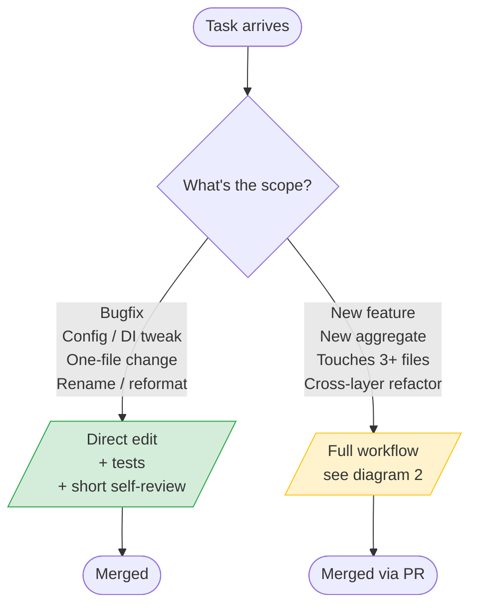

# DotLightSkillset

**A lightweight, curated Claude Code skillset for .NET developers.**

Plugin identifier: `dotlight-skillset`

Combines three upstream MIT skill libraries into one opinionated bundle, with workflow overrides that fix the rough edges of "pure TDD" agent loops.

## What it bundles

- **Workflow (18 skills)** — customized fork of [obra/superpowers](https://github.com/obra/superpowers) plus four adapted skills from [mattpocock/skills](https://github.com/mattpocock/skills) (`grill-me`, `design-an-interface`, `grill-with-docs`) and two from [hsmejky/skills](https://github.com/hsmejky/skills) (`improve-architecture`, `caveman`): brainstorming → writing-plans → executing-plans → TDD → code review → finishing-branch, plus worktrees, systematic-debugging, parallel agents, skill authoring, doc-aware grilling (`grill-with-docs`), Ousterhout-style architecture review (`improve-architecture`), and explicit-trigger ultra-terse mode (`caveman`).
- **.NET patterns (26 skills)** — curated fork of [Aaronontheweb/dotnet-skills](https://github.com/Aaronontheweb/dotnet-skills): C# standards, Minimal API design, DI, configuration, serialization, Aspire (4 skills — configuration, service-defaults, integration-testing, **mcp-first** for runtime debugging), OpenTelemetry, Testcontainers, Playwright (Blazor + CI caching), ILSpy decompilation, quality gates (slopwatch + CRAP). Plus dotlight-original **`rider-mcp-first`** — when JetBrains Rider MCP is attached, force semantic operations over filesystem Grep/Read for **50–90 % token savings on .NET exploration**.
- **Specialized .NET agents (3)** — `dotnet-performance-analyst`, `dotnet-benchmark-designer`, `dotnet-concurrency-specialist`. Use the `Agent` tool with `subagent_type` matching the agent name.

Superpowers drives the **process**, dotnet-skills supply the **patterns**, agents do **focused diagnostic work**.

## Why this exists

Out-of-the-box Superpowers has two habits that hurt .NET projects:

1. **TDD-first domain discovery.** "Minimal code to pass" applied literally produces entities without relationships and invariants.
2. **Text-based Socratic dialogue.** Multiple-choice questions as plain-text lists, even in clients that render `AskUserQuestion` as clickable choice cards.

Fixed in modified `SKILL.md` files:

- **`brainstorming`** — prefers `AskUserQuestion` over text multi-choice, caps questions at 5-8, enforces Domain Model as the first design section.
- **`writing-plans`** — requires a `## Domain Model` section derived from the design. If missing, loops back to brainstorming. Default exec sub-skill is `executing-plans`, not `subagent-driven-development`.
- **`test-driven-development`** — domain model must exist in the plan before first RED-GREEN-REFACTOR. Calls out "test-cheating" (satisfying tests by violating invariants) as the #1 LLM-TDD failure mode.

## What's deliberately excluded

- From Superpowers: `subagent-driven-development` (too slow; prefer `executing-plans`)
- From dotnet-skills (skills): all `akka-*` (5), `aspire-mailpit-integration`, `mjml-email-templates`, `verify-email-snapshots`, `marketplace-publishing`, `skills-index-snippets`
- From dotnet-skills (agents): `akka-net-specialist`, `docfx-specialist`, `roslyn-incremental-generator-specialist`

For Akka.NET, Mailpit, or DocFX work, install the upstream `dotnet-skills` plugin alongside — they cooperate fine.

## Companion plugins (recommended pairings)

DotLightSkillset focuses on the .NET workflow surface. For adjacent specialties, pair it with:

- **[VoltAgent — `voltagent-data-ai`](https://github.com/VoltAgent/awesome-claude-code-subagents)** — specialist agents for data-heavy .NET work: `postgres-pro`, `database-optimizer`, `data-engineer`, `ml-engineer`, `data-scientist`. Particularly useful with TimescaleDB / EF Core / NHibernate projects that grow ML-adjacent.
- **`playwright@claude-plugins-official`** — general Playwright MCP integration for non-Blazor SPA stacks (Vue/Vite, React, etc.). Dotlight only ships the Blazor-specific Playwright skill.

These work in parallel — no conflicts.

## Who this is for

.NET developers using **.NET 10**, **Aspire** (or pure host builders), **Minimal API**, **NHibernate or EF Core**, **Postgres / TimescaleDB**, and **Vue/Vite** or **Blazor** frontends, who want the auto-review / brainstorming / planning flow from Superpowers without having the agent design the domain for them via TDD. If you also need Akka.NET, install the upstream `dotnet-skills` plugin alongside — DotLightSkillset is opinionated about which extensions live in scope.

## Installation

### Public marketplace (recommended)

```
/plugin marketplace add MudraMartin/dotlight-skillset
/plugin install dotlight-skillset@dotlight-marketplace
```

Update:

```
/plugin marketplace update
```

### Local clone

```bash
git clone https://github.com/MudraMartin/dotlight-skillset.git ~/dotlight-skillset
```

Then in Claude Code:

```
/plugin marketplace add ~/dotlight-skillset
/plugin install dotlight-skillset@dotlight-marketplace
```

### `.plugin` file (offline)

```bash
cd dotlight-skillset
zip -r dotlight-skillset.plugin . -x "*.DS_Store" -x ".git/*"
```

Then drag-drop or use your client's plugin install flow.

## What's in the plugin

### Workflow (18 skills)

| Skill | Role |
|---|---|
| `brainstorming` | Socratic design refinement — **uses `AskUserQuestion`** + enforces domain-first design |
| `grill-me`† | Stress-test an existing plan/spec — branch-by-branch interrogation with recommended answers. Cross-references to `grill-with-docs` when project has docs. |
| `grill-with-docs`† 🆕 | Doc-aware grilling — same Socratic discipline, plus glossary cross-check, code cross-reference, inline updates to glossary / ADRs. Path discovery for any project layout. |
| `improve-architecture`‡ 🆕 | Ousterhout-style audit — find shallow modules, propose deepening opportunities. Disciplined vocabulary (Module / Interface / Depth / Seam / Adapter / Leverage / Locality), deletion test, parallel sub-agent design when needed. |
| `design-an-interface`† | Generate 3–4 radically different designs in parallel, then compare on depth and ease of correct use. (Lighter standalone variant of `improve-architecture/INTERFACE-DESIGN.md`.) |
| `writing-plans` | Bite-sized plan — **requires `## Domain Model`** or loops back |
| `executing-plans` | Batch execution with human checkpoints (preferred exec mode) |
| `test-driven-development` | RED-GREEN-REFACTOR with domain-model guard |
| `requesting-code-review` | Pre-review checklist |
| `receiving-code-review` | Responding to feedback |
| `systematic-debugging` | 4-phase root-cause process |
| `verification-before-completion` | Make sure it's actually done |
| `dispatching-parallel-agents` | Parallel subagents for independent tasks |
| `using-git-worktrees` | Parallel development for larger features |
| `finishing-a-development-branch` | Merge/PR/keep/discard decision flow |
| `caveman`‡ 🆕 | Ultra-compressed response mode (~75% token savings, bullets-only, UTF substitutions). **Activates ONLY on explicit trigger** ("caveman mode" / "/caveman") — tightened from upstream to avoid accidental activation on phrases like "be brief". |
| `writing-skills` | Author new skills |
| `using-superpowers` | Intro to the system |

† Adapted from [mattpocock/skills](https://github.com/mattpocock/skills); ‡ adapted from [hsmejky/skills](https://github.com/hsmejky/skills) (a fork of mattpocock — both attributions preserved); the rest are from [obra/superpowers](https://github.com/obra/superpowers).

### .NET patterns (26 skills)

| Skill | Role |
|---|---|
| `modern-csharp-coding-standards` | Records, pattern matching, nullable types |
| `csharp-concurrency-patterns` | Task vs Channel vs lock |
| `api-design` | Minimal API extend-only design, versioning |
| `type-design-performance` | Sealed classes, readonly structs, Span<T> |
| `dependency-injection-patterns` | IServiceCollection, scopes, keyed services |
| `microsoft-extensions-configuration` | IOptions, secrets, env config |
| `serialization` | YamlDotNet, System.Text.Json source gen, AOT |
| `dotnet-project-structure` | Solution layout, Directory.Build.props |
| `package-management` | Central Package Management |
| `dotnet-local-tools` | dotnet tool manifests |
| `dotnet-devcert-trust` | HTTPS dev cert |
| `database-performance` | Read/write separation, N+1, AsNoTracking |
| `efcore-patterns` | EF Core entity configuration and queries |
| `aspire-configuration` | AppHost as explicit env-var bridge; app code free of Aspire clients |
| `aspire-service-defaults` | Shared OpenTelemetry / health checks / resilience / discovery setup |
| `aspire-integration-testing` | `DistributedApplicationTestingBuilder` — primary lever for parallel integration tests |
| `aspire-mcp-first` ⚡ | When `mcp__aspire__*` attached + AppHost running, force MCP for resource state / logs / traces over `docker logs` and port-guessing. Situational. |
| `opentelemetry-instrumentation` | ActivitySource/Meter patterns, semantic conventions, zero-allocation paths |
| `testcontainers-integration-tests` | Docker-based integration tests (alternative to Aspire) |
| `snapshot-testing` | Verify library, approval testing |
| `playwright-ci-caching` | Browser caching in CI |
| `playwright-blazor-testing` | UI tests for Blazor Server / WebAssembly |
| `ilspy-decompile` | Inspect compiled .NET assemblies via `ilspycmd` |
| `rider-mcp-first` ⚡ | **EXTREMELY-IMPORTANT** — when JetBrains Rider MCP is attached, force `mcp__rider__*` semantic ops before Grep/Read/Edit. ~50–90 % token savings on .NET exploration. |
| `dotnet-slopwatch` | Quality gate — detects LLM-generated anti-patterns |
| `crap-analysis` | Quality gate — CRAP score, flags trivial tests |

### Specialized .NET agents (3)

Invoke via the `Agent` tool with `subagent_type: <agent-name>`.

| Agent | Use for |
|---|---|
| `dotnet-performance-analyst` | Interpreting JetBrains profiler / BenchmarkDotNet output, regression detection, hot-path delegate allocation analysis |
| `dotnet-benchmark-designer` | Designing reliable BenchmarkDotNet suites; deciding when BDN doesn't fit and a custom harness is needed |
| `dotnet-concurrency-specialist` | Diagnosing race conditions, async/await pitfalls, deadlocks, and timing-dependent test failures |

## How it flows

### 1. Triage — which track does this task take?



Superpowers defaults to "brainstorm everything" — the override skips that for small changes.

### 2. Full feature flow


Two loop-backs do the real work: **`writing-plans` → `brainstorming`** when the domain model is missing, and **`requesting-code-review` → `executing-plans`** when quality gates find critical issues. Two opt-in side-trips strengthen the design before it locks in: **`design-an-interface`** when the public surface is hard to change later, and **`grill-me`** when a draft spec or thin domain model needs branch-by-branch interrogation.

### 3. TDD with the domain-first guard


If a test can pass by violating an invariant, the **test** is wrong, not the code. Rewrite the test to enforce the model, then implement honestly.

## Project integration

Add a `CLAUDE.md` in your project root:

```markdown
## Workflow

Full workflow (brainstorming → plan → TDD → review) only for new features touching
3+ files or introducing a new aggregate, and for cross-layer refactors. For
bugfixes, config tweaks, one-file changes: edit directly, run tests, short review.

## Exec mode

Prefer `executing-plans` over `subagent-driven-development`. Use
`dispatching-parallel-agents` only when >5 tasks are genuinely independent.

## Quality gates

When invoking `requesting-code-review`, also run `dotnet-slopwatch` and
`crap-analysis`. Critical findings block merge.

## Interaction

Prefer `AskUserQuestion` for 2-4 choice questions. First option is the
recommended default labeled "(Recommended)".
```

The plugin provides the skills — `CLAUDE.md` tells the agent when to use them.

## License and attribution

DotLightSkillset is MIT-licensed, © 2026 Martin Mudra. See [`LICENSE`](./LICENSE).

Combines modified forks of three upstream MIT projects, with all licenses preserved verbatim in [`THIRD_PARTY_LICENSES.md`](./THIRD_PARTY_LICENSES.md):

- **[obra/superpowers](https://github.com/obra/superpowers)** — © 2025 Jesse Vincent / Prime Radiant
- **[Aaronontheweb/dotnet-skills](https://github.com/Aaronontheweb/dotnet-skills)** — © 2025 Aaron Stannard
- **[mattpocock/skills](https://github.com/mattpocock/skills)** — © 2026 Matt Pocock (`grill-me`, `design-an-interface`, `grill-with-docs`)
- **[hsmejky/skills](https://github.com/hsmejky/skills)** — © 2026 Jan Smejkal (fork modifications) + © 2026 Matt Pocock (original work, preserved) (`improve-architecture`, `caveman`)

When redistributing (fork, rebrand, package), all license files must remain.

## Contributing & status

**v0.5.0 — `grill-with-docs` + `improve-architecture` + `caveman`.** Three new workflow skills with `AskUserQuestion` clickable-card preload. `grill-with-docs` is the doc-aware sibling of `grill-me` — cross-checks user terminology against the project glossary (with path discovery for `CONTEXT.md` / `project_conventions.md` / `Resources/Specifications/V*_*.md`), cross-references claims with the code, writes resolutions back into the docs (inline glossary + ADR offers when justified). `improve-architecture` is an Ousterhout-style deep-modules audit with disciplined vocabulary and `.NET`-specific deepening patterns. `caveman` is an explicit-trigger ultra-compressed response mode (bullets only, ≤8 words/bullet, UTF substitutions). Trigger description tightened from upstream — only activates on explicit phrases like "caveman mode" / "/caveman", not on ambiguous shortcuts like "be brief". Added `hsmejky/skills` as 4th upstream attribution.

**v0.4.2 — `aspire-mcp-first` + sharper `rider-mcp-first` invocation.** New skill `aspire-mcp-first` for the Aspire CLI MCP server (`aspire agent mcp` / `aspire mcp init`) — when AppHost is running, runtime queries (resource state, logs, traces, dynamic endpoints) go through `mcp__aspire__*` instead of `docker logs` and port-guessing. `rider-mcp-first` description rewritten as imperative + body lead now demands an immediate tool-list scan and adds a per-call gate, fixing the persistent fallback-to-`Grep` leak.

**v0.4.0 — `rider-mcp-first`.** New EXTREMELY-IMPORTANT skill: when JetBrains Rider MCP is attached (`mcp__rider__*` in tool list), use Rider's ReSharper-indexed semantic operations before filesystem Grep/Read/Edit for any .NET work. Saves ~105 K tokens per typical exploration session. Pair with `<project-root>/.mcp.json` registering Rider's MCP endpoint (`http://127.0.0.1:64342/stream` for newer JetBrains MCP plugin versions).

**v0.3.0 — Aspire is back.** Six new dotnet skills (3× Aspire, OpenTelemetry, ILSpy, Blazor Playwright), three specialized agents (`dotnet-performance-analyst`, `dotnet-benchmark-designer`, `dotnet-concurrency-specialist`), and a fix for the long-standing `AskUserQuestion` deferred-tool problem in `brainstorming` and `grill-me`. See `CHANGELOG.md`.

This plugin is an opinionated curation. Requests to re-bloat it toward the full upstreams (Akka.NET, Mailpit, DocFX, Roslyn generators) will be declined — install those upstreams directly. PRs welcome for SKILL.md fixes, `AskUserQuestion` / domain-first / executing-plans refinements, and additional quality gates reinforcing "patterns over TDD-discovery."
