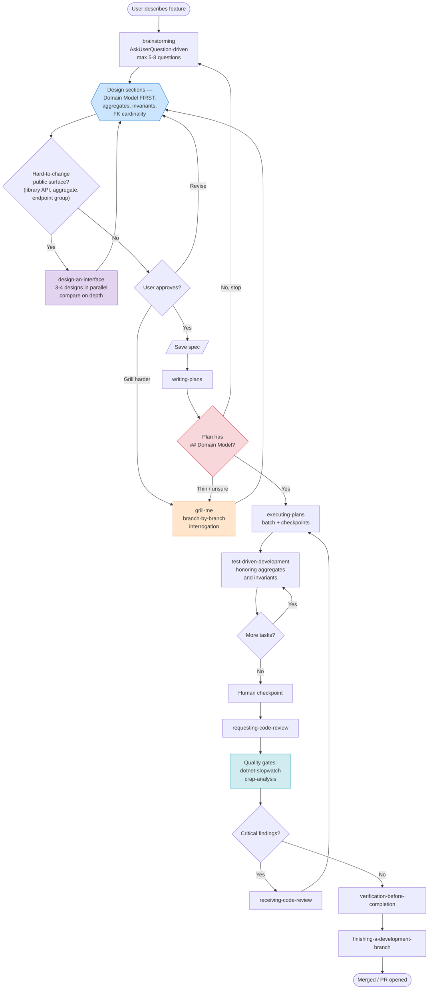
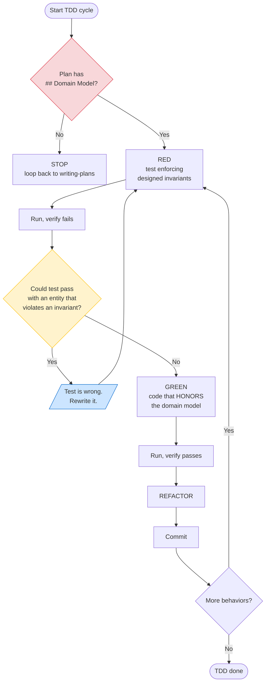

# DotLightSkillset

**A lightweight, curated Claude Code skillset for .NET developers.**

Plugin identifier: `dotlight-skillset`

Combines three upstream MIT skill libraries into one opinionated bundle, with workflow overrides that fix the rough edges of "pure TDD" agent loops.

## What it bundles

- **Workflow (15 skills)** — customized fork of [obra/superpowers](https://github.com/obra/superpowers) plus two adapted skills from [mattpocock/skills](https://github.com/mattpocock/skills) (`grill-me`, `design-an-interface`): brainstorming → writing-plans → executing-plans → TDD → code review → finishing-branch, plus worktrees, systematic-debugging, parallel agents, skill authoring, design-stress-testing, and parallel interface design.
- **.NET patterns (18 skills)** — curated fork of [Aaronontheweb/dotnet-skills](https://github.com/Aaronontheweb/dotnet-skills): C# standards, Minimal API design, DI, configuration, serialization, Testcontainers, Playwright CI caching, quality gates (slopwatch + CRAP).

Superpowers drives the **process**, dotnet-skills supply the **patterns**.

## Why this exists

Out-of-the-box Superpowers has two habits that hurt .NET projects:

1. **TDD-first domain discovery.** "Minimal code to pass" applied literally produces entities without relationships and invariants.
2. **Text-based Socratic dialogue.** Multiple-choice questions as plain-text lists, even in clients that render `AskUserQuestion` as clickable choice cards.

Fixed in modified `SKILL.md` files:

- **`brainstorming`** — prefers `AskUserQuestion` over text multi-choice, caps questions at 5-8, enforces Domain Model as the first design section.
- **`writing-plans`** — requires a `## Domain Model` section derived from the design. If missing, loops back to brainstorming. Default exec sub-skill is `executing-plans`, not `subagent-driven-development`.
- **`test-driven-development`** — domain model must exist in the plan before first RED-GREEN-REFACTOR. Calls out "test-cheating" (satisfying tests by violating invariants) as the #1 LLM-TDD failure mode.

## What's deliberately excluded

- From Superpowers: `subagent-driven-development` (too slow; prefer `executing-plans`)
- From dotnet-skills: all `akka-*` (5), all `aspire-*` (4), `playwright-blazor`, `mjml-email-templates`, `verify-email-snapshots`, `opentelementry-dotnet-instrumentation`, `ilspy-decompile`, `marketplace-publishing`, `skills-index-snippets`

For those, install the upstream plugins alongside DotLightSkillset — they cooperate fine.

## Who this is for

.NET developers using **Minimal API**, **NHibernate or EF Core**, and **Vue/Vite** or **Blazor** frontends, who want the auto-review / brainstorming / planning flow from Superpowers without having the agent design the domain for them via TDD. If you're on Aspire or Akka.NET, install the full [Aaronontheweb/dotnet-skills](https://github.com/Aaronontheweb/dotnet-skills) instead — DotLightSkillset is opinionated about omissions.

## Installation

### Public marketplace (recommended)

```
/plugin marketplace add MudraMartin/dotlight-skillset
/plugin install dotlight-skillset@dotlight-marketplace
```

Update:

```
/plugin marketplace update
```

### Local clone

```bash
git clone https://github.com/MudraMartin/dotlight-skillset.git ~/dotlight-skillset
```

Then in Claude Code:

```
/plugin marketplace add ~/dotlight-skillset
/plugin install dotlight-skillset@dotlight-marketplace
```

### `.plugin` file (offline)

```bash
cd dotlight-skillset
zip -r dotlight-skillset.plugin . -x "*.DS_Store" -x ".git/*"
```

Then drag-drop or use your client's plugin install flow.

## What's in the plugin

### Workflow (15 skills)

| Skill | Role |
|---|---|
| `brainstorming` | Socratic design refinement — **uses `AskUserQuestion`** + enforces domain-first design |
| `grill-me`† | Stress-test an existing plan/spec — branch-by-branch interrogation with recommended answers |
| `design-an-interface`† | Generate 3–4 radically different designs in parallel, then compare on depth and ease of correct use |
| `writing-plans` | Bite-sized plan — **requires `## Domain Model`** or loops back |
| `executing-plans` | Batch execution with human checkpoints (preferred exec mode) |
| `test-driven-development` | RED-GREEN-REFACTOR with domain-model guard |
| `requesting-code-review` | Pre-review checklist |
| `receiving-code-review` | Responding to feedback |
| `systematic-debugging` | 4-phase root-cause process |
| `verification-before-completion` | Make sure it's actually done |
| `dispatching-parallel-agents` | Parallel subagents for independent tasks |
| `using-git-worktrees` | Parallel development for larger features |
| `finishing-a-development-branch` | Merge/PR/keep/discard decision flow |
| `writing-skills` | Author new skills |
| `using-superpowers` | Intro to the system |

† Adapted from [mattpocock/skills](https://github.com/mattpocock/skills); the rest are from [obra/superpowers](https://github.com/obra/superpowers).

### .NET patterns (18 skills)

| Skill | Role |
|---|---|
| `modern-csharp-coding-standards` | Records, pattern matching, nullable types |
| `csharp-concurrency-patterns` | Task vs Channel vs lock |
| `api-design` | Minimal API extend-only design, versioning |
| `type-design-performance` | Sealed classes, readonly structs, Span<T> |
| `dependency-injection-patterns` | IServiceCollection, scopes, keyed services |
| `microsoft-extensions-configuration` | IOptions, secrets, env config |
| `serialization` | YamlDotNet, System.Text.Json source gen, AOT |
| `dotnet-project-structure` | Solution layout, Directory.Build.props |
| `package-management` | Central Package Management |
| `dotnet-local-tools` | dotnet tool manifests |
| `dotnet-devcert-trust` | HTTPS dev cert |
| `database-performance` | Read/write separation, N+1, AsNoTracking |
| `efcore-patterns` | EF Core entity configuration and queries |
| `testcontainers-integration-tests` | Docker-based integration tests |
| `snapshot-testing` | Verify library, approval testing |
| `playwright-ci-caching` | Browser caching in CI |
| `dotnet-slopwatch` | Quality gate — detects LLM-generated anti-patterns |
| `crap-analysis` | Quality gate — CRAP score, flags trivial tests |

## How it flows

### 1. Triage — which track does this task take?


Superpowers defaults to "brainstorm everything" — the override skips that for small changes.

### 2. Full feature flow



Two loop-backs do the real work: **`writing-plans` → `brainstorming`** when the domain model is missing, and **`requesting-code-review` → `executing-plans`** when quality gates find critical issues. Two opt-in side-trips strengthen the design before it locks in: **`design-an-interface`** when the public surface is hard to change later, and **`grill-me`** when a draft spec or thin domain model needs branch-by-branch interrogation.

### 3. TDD with the domain-first guard



If a test can pass by violating an invariant, the **test** is wrong, not the code. Rewrite the test to enforce the model, then implement honestly.

## Project integration

Add a `CLAUDE.md` in your project root:

```markdown
## Workflow

Full workflow (brainstorming → plan → TDD → review) only for new features touching
3+ files or introducing a new aggregate, and for cross-layer refactors. For
bugfixes, config tweaks, one-file changes: edit directly, run tests, short review.

## Exec mode

Prefer `executing-plans` over `subagent-driven-development`. Use
`dispatching-parallel-agents` only when >5 tasks are genuinely independent.

## Quality gates

When invoking `requesting-code-review`, also run `dotnet-slopwatch` and
`crap-analysis`. Critical findings block merge.

## Interaction

Prefer `AskUserQuestion` for 2-4 choice questions. First option is the
recommended default labeled "(Recommended)".
```

The plugin provides the skills — `CLAUDE.md` tells the agent when to use them.

## License and attribution

DotLightSkillset is MIT-licensed, © 2026 Martin Mudra. See [`LICENSE`](./LICENSE).

Combines modified forks of three upstream MIT projects, with all licenses preserved verbatim in [`THIRD_PARTY_LICENSES.md`](./THIRD_PARTY_LICENSES.md):

- **[obra/superpowers](https://github.com/obra/superpowers)** — © 2025 Jesse Vincent / Prime Radiant
- **[Aaronontheweb/dotnet-skills](https://github.com/Aaronontheweb/dotnet-skills)** — © 2025 Aaron Stannard
- **[mattpocock/skills](https://github.com/mattpocock/skills)** — © 2026 Matt Pocock (`grill-me` and `design-an-interface` only)

When redistributing (fork, rebrand, package), all license files must remain.

## Contributing & status

**v0.1.0 — initial release.** Early; expect churn.

This plugin is an opinionated curation. Requests to re-bloat it toward the upstreams (full Akka.NET, Aspire, etc.) will be declined — install those upstreams directly. PRs welcome for SKILL.md fixes, `AskUserQuestion` / domain-first / executing-plans refinements, and additional quality gates reinforcing "patterns over TDD-discovery."
