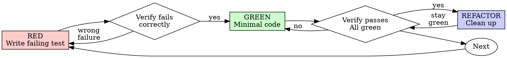

# Test-Driven Development (TDD)

## Overview

Write the test first. Watch it fail. Write minimal code to pass.

**Core principle:** If you didn't watch the test fail, you don't know if it tests the right thing.

**Violating the letter of the rules is violating the spirit of the rules.**

## Prerequisite: Domain Model Must Exist First

**Before the first RED-GREEN-REFACTOR cycle**, confirm that the implementation plan contains a `## Domain Model` section with aggregates, entities, relationships, and invariants. If it doesn't, STOP and loop back to `writing-plans` / `brainstorming`.

**Direct-track exception (no plan exists by design):** on the triage Direct track — bugfix, code port, one-file change — there is no plan document, and this gate does not send you to writing-plans. The domain model is the existing code's invariants and mappings: read them, then write the failing test against them. The Persistence Model gate below still applies in full — a Direct-track task that would add or change a migration, table, persisted entity, or mapping has outgrown the Direct track; STOP and switch to the full workflow.

**"Minimal code to pass" ≠ "code that ignores the domain model".** When writing GREEN-phase code:
- Respect aggregate boundaries from the plan — don't introduce an entity without the FK that the design says it has
- Respect invariants from the plan — a test that passes by violating an invariant is a test that is wrong, not evidence to drop the invariant
- If satisfying a test would require breaking the domain model, the TEST is wrong — rewrite it to reflect the domain, then make it pass honestly

This is the #1 TDD failure mode for LLM-driven coding: tests pass because the agent generated trivial entities with no relationships. That is not TDD, that is test-cheating. If you catch yourself doing this, stop and re-read the domain model section of the plan.

Its sibling failure mode: **tautological tests** — the assertion recomputes the expected value the same way the code does (`expect(add(a, b)).toBe(a + b)`, a constant asserted equal to itself), so the test passes by construction and can never disagree with the code. Expected values must come from an independent source of truth — a known-good literal, a worked example, the spec.

## Prerequisite: Persistence Model Gates Schema Changes

The moment any step would add or change a **migration, table, persisted entity, or mapping** (EF Core configuration, NHibernate mapping), check the plan's `## Persistence Model` section for that table. Section missing, or the table isn't in it → **STOP**, loop back to `writing-plans` (on the Direct track: switch to the full workflow — schema is never designed without a plan). Do not "just add the column" — that is how schemas get tailor-made for tests instead of designed.

When the section exists, GREEN-phase schema code transcribes it: same names, types, nullability, constraints, and lifecycle pattern. A test never justifies a schema deviation. If the designed schema can't satisfy the test, either the test is wrong (rewrite it) or the design needs revision (a `writing-plans` decision with your human partner) — never silent schema drift.

## Prerequisite: Pre-Agreed Seams

A **seam** is the public boundary you test at — the interface where you observe behavior without reaching inside. Tests live at seams, never against internals.

**Before writing any test**, write down the seams under test and confirm them with your human partner. No test gets written at an unconfirmed seam. You can't test everything — agreeing seams up front puts testing effort on critical paths and complex logic, and caps test volume at what a human can review.

## When to Use

**Always:**
- New features
- Bug fixes
- Refactoring
- Behavior changes

**Exceptions (ask your human partner):**
- Throwaway prototypes
- Generated code
- Configuration files

Thinking "skip TDD just this once"? Stop. That's rationalization.

## The Iron Law

```
NO PRODUCTION CODE WITHOUT A FAILING TEST FIRST
```

Write code before the test? Delete it. Start over.

**No exceptions:**
- Don't keep it as "reference"
- Don't "adapt" it while writing tests
- Don't look at it
- Delete means delete

Implement fresh from tests. Period.

## Red-Green-Refactor



### RED - Write Failing Test

Write one minimal test showing what should happen.

<Good>
```typescript
test('retries failed operations 3 times', async () => {
  let attempts = 0;
  const operation = () => {
    attempts++;
    if (attempts < 3) throw new Error('fail');
    return 'success';
  };

  const result = await retryOperation(operation);

  expect(result).toBe('success');
  expect(attempts).toBe(3);
});
```
Clear name, tests real behavior, one thing
</Good>

<Bad>
```typescript
test('retry works', async () => {
  const mock = jest.fn()
    .mockRejectedValueOnce(new Error())
    .mockRejectedValueOnce(new Error())
    .mockResolvedValueOnce('success');
  await retryOperation(mock);
  expect(mock).toHaveBeenCalledTimes(3);
});
```
Vague name, tests mock not code
</Bad>

**Requirements:**
- One behavior
- Clear name
- Real code (no mocks unless unavoidable)

### Verify RED - Watch It Fail

**MANDATORY. Never skip.**

```bash
npm test path/to/test.test.ts
```

Confirm:
- Test fails (not errors)
- Failure message is expected
- Fails because feature missing (not typos)

**Test passes?** You're testing existing behavior. Fix test.

**Test errors?** Fix error, re-run until it fails correctly.

### GREEN - Minimal Code

Write simplest code to pass the test.

<Good>
```typescript
async function retryOperation<T>(fn: () => Promise<T>): Promise<T> {
  for (let i = 0; i < 3; i++) {
    try {
      return await fn();
    } catch (e) {
      if (i === 2) throw e;
    }
  }
  throw new Error('unreachable');
}
```
Just enough to pass
</Good>

<Bad>
```typescript
async function retryOperation<T>(
  fn: () => Promise<T>,
  options?: {
    maxRetries?: number;
    backoff?: 'linear' | 'exponential';
    onRetry?: (attempt: number) => void;
  }
): Promise<T> {
  // YAGNI
}
```
Over-engineered
</Bad>

Don't add features, refactor other code, or "improve" beyond the test. Red comes before green, always — don't anticipate future tests or add speculative features.

### Verify GREEN - Watch It Pass

**MANDATORY.**

```bash
npm test path/to/test.test.ts
```

Confirm:
- Test passes
- Other tests still pass
- Output pristine (no errors, warnings)

**Test fails?** Fix code, not test.

**Other tests fail?** Fix now.

### REFACTOR - Clean Up

After green only:
- Remove duplication
- Improve names
- Extract helpers

Keep tests green. Don't add behavior.

### Repeat

Next failing test for next feature.

## Good Tests

| Quality | Good | Bad |
|---------|------|-----|
| **Minimal** | One thing. "and" in name? Split it. | `test('validates email and domain and whitespace')` |
| **Clear** | Name describes behavior | `test('test1')` |
| **Shows intent** | Demonstrates desired API | Obscures what code should do |

## Why Order Matters

**"I'll write tests after to verify it works"**

Tests written after code pass immediately. Passing immediately proves nothing:
- Might test wrong thing
- Might test implementation, not behavior
- Might miss edge cases you forgot
- You never saw it catch the bug

Test-first forces you to see the test fail, proving it actually tests something.

**"I already manually tested all the edge cases"**

Manual testing is ad-hoc. You think you tested everything but:
- No record of what you tested
- Can't re-run when code changes
- Easy to forget cases under pressure
- "It worked when I tried it" ≠ comprehensive

Automated tests are systematic. They run the same way every time.

**"Deleting X hours of work is wasteful"**

Sunk cost fallacy. The time is already gone. Your choice now:
- Delete and rewrite with TDD (X more hours, high confidence)
- Keep it and add tests after (30 min, low confidence, likely bugs)

The "waste" is keeping code you can't trust. Working code without real tests is technical debt.

**"TDD is dogmatic, being pragmatic means adapting"**

TDD IS pragmatic:
- Finds bugs before commit (faster than debugging after)
- Prevents regressions (tests catch breaks immediately)
- Documents behavior (tests show how to use code)
- Enables refactoring (change freely, tests catch breaks)

"Pragmatic" shortcuts = debugging in production = slower.

**"Tests after achieve the same goals - it's spirit not ritual"**

No. Tests-after answer "What does this do?" Tests-first answer "What should this do?"

Tests-after are biased by your implementation. You test what you built, not what's required. You verify remembered edge cases, not discovered ones.

Tests-first force edge case discovery before implementing. Tests-after verify you remembered everything (you didn't).

30 minutes of tests after ≠ TDD. You get coverage, lose proof tests work.

## Common Rationalizations

| Excuse | Reality |
|--------|---------|
| "Too simple to test" | Simple code breaks. Test takes 30 seconds. |
| "I'll test after" | Tests passing immediately prove nothing. |
| "Tests after achieve same goals" | Tests-after = "what does this do?" Tests-first = "what should this do?" |
| "Already manually tested" | Ad-hoc ≠ systematic. No record, can't re-run. |
| "Deleting X hours is wasteful" | Sunk cost fallacy. Keeping unverified code is technical debt. |
| "Keep as reference, write tests first" | You'll adapt it. That's testing after. Delete means delete. |
| "Need to explore first" | Fine. Throw away exploration, start with TDD. |
| "Test hard = design unclear" | Listen to test. Hard to test = hard to use. |
| "TDD will slow me down" | TDD faster than debugging. Pragmatic = test-first. |
| "Manual test faster" | Manual doesn't prove edge cases. You'll re-test every change. |
| "Existing code has no tests" | You're improving it. Add tests for existing code. |
| "It's just one nullable column" | Test-shaped schemas accrete one "just one column" at a time. Design it in the plan first. |

## Red Flags - STOP and Start Over

- Code before test
- Migration or persisted column not present in the plan's `## Persistence Model`
- Adding a column because a test asserts it
- Test after implementation
- Test passes immediately
- Can't explain why test failed
- Tests added "later"
- Rationalizing "just this once"
- "I already manually tested it"
- "Tests after achieve the same purpose"
- "It's about spirit not ritual"
- "Keep as reference" or "adapt existing code"
- "Already spent X hours, deleting is wasteful"
- "TDD is dogmatic, I'm being pragmatic"
- "This is different because..."

**All of these mean: Delete code. Start over with TDD.**

## Example: Bug Fix

**Bug:** Empty email accepted

**RED**
```typescript
test('rejects empty email', async () => {
  const result = await submitForm({ email: '' });
  expect(result.error).toBe('Email required');
});
```

**Verify RED**
```bash
$ npm test
FAIL: expected 'Email required', got undefined
```

**GREEN**
```typescript
function submitForm(data: FormData) {
  if (!data.email?.trim()) {
    return { error: 'Email required' };
  }
  // ...
}
```

**Verify GREEN**
```bash
$ npm test
PASS
```

**REFACTOR**
Extract validation for multiple fields if needed.

## Verification Checklist

Before marking work complete:

- [ ] Every new function/method has a test
- [ ] Watched each test fail before implementing
- [ ] Each test failed for expected reason (feature missing, not typo)
- [ ] Wrote minimal code to pass each test
- [ ] All tests pass
- [ ] Output pristine (no errors, warnings)
- [ ] Tests use real code (mocks only if unavoidable)
- [ ] Edge cases and errors covered

Can't check all boxes? You skipped TDD. Start over.

## When Stuck

| Problem | Solution |
|---------|----------|
| Don't know how to test | Write wished-for API. Write assertion first. Ask your human partner. |
| Test too complicated | Design too complicated. Simplify interface. |
| Must mock everything | Code too coupled. Use dependency injection. |
| Test setup huge | Extract helpers. Still complex? Simplify design. |

## Debugging Integration

Bug found? Write failing test reproducing it. Follow TDD cycle. Test proves fix and prevents regression.

Never fix bugs without a test.

## Testing Anti-Patterns

When adding mocks or test utilities, read [testing-anti-patterns.md](testing-anti-patterns.md) to avoid common pitfalls:
- Testing mock behavior instead of real behavior
- Adding test-only methods to production classes
- Mocking without understanding dependencies

## Final Rule

```
Production code → test exists and failed first
Otherwise → not TDD
```

No exceptions without your human partner's permission.
